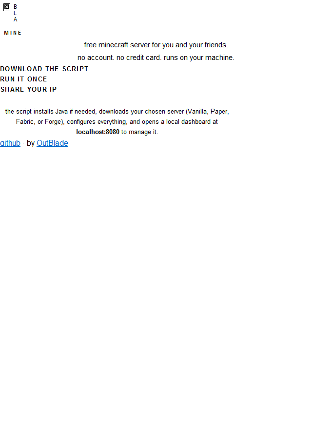

# mineblade

[](https://outblade.github.io/mineblade/)

**free minecraft server for you and your friends — runs on your machine, set up in one command.**

no account. no credit card. no cloud. just download the script and play.

---

## how it works

1. visit the site and click download (or copy the one-liner below)
2. run the script — it handles everything
3. share your IP with friends and play

the script installs Java if you don't have it, lets you pick a server type and version, configures everything, and opens a local dashboard at `localhost:8080` so you can manage it.

---

## quick start

**Windows** — download `scripts/setup.ps1`, right-click it, and choose **Run with PowerShell**.

**Mac / Linux**

```bash
curl -sSL https://raw.githubusercontent.com/OutBlade/mineblade/main/scripts/setup.sh | bash
```

---

## what the script does

1. installs Java 21 if missing (via winget / brew / apt / dnf / pacman)
2. asks you to pick a server type: Vanilla, Paper, Fabric, or Forge
3. fetches the latest available versions and lets you choose
4. downloads the server jar
5. writes `eula.txt` and `server.properties`
6. opens firewall port 25565
7. installs and starts the local dashboard at `localhost:8080`
8. shows port forwarding instructions so remote friends can join

---

## dashboard

after setup, a lightweight web dashboard runs at `http://localhost:8080`.

it shows server status, player count, live console output, and start/stop controls. built with plain Python — no dependencies beyond what is already installed.

---

## server types

| type    | description                              |
|---------|------------------------------------------|
| Vanilla | official Mojang server                   |
| Paper   | high-performance drop-in replacement     |
| Fabric  | lightweight mod loader                   |
| Forge   | mod loader (manual jar placement needed) |

---

## requirements

- Windows 10/11, macOS 12+, or any modern Linux distro
- internet connection for the initial setup
- Python 3 (for the dashboard — usually already installed on Mac/Linux; installed automatically on Windows)

---

## port forwarding

to let friends outside your network join, you need to forward **TCP port 25565** on your router to your machine's local IP. the setup script shows your local IP and walks you through it.

---

## license

MIT — by [OutBlade](https://github.com/OutBlade)
