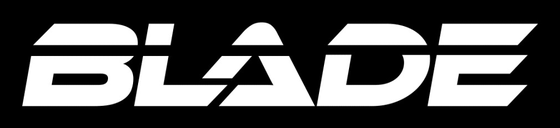

# mineblade

<div align="center">



<br/>

**A Minecraft server in 60 seconds. No account, no cloud, no monthly fee. Your machine is the server.**

[](LICENSE)
[](#requirements)
[](#server-types)
[](#java)
[](https://python.org)

**Windows**

```powershell
Set-ExecutionPolicy Bypass -Scope Process -Force; irm https://raw.githubusercontent.com/OutBlade/mineblade/main/scripts/setup.ps1 | iex
```

**macOS / Linux**

```bash
curl -sSL https://raw.githubusercontent.com/OutBlade/mineblade/main/scripts/setup.sh | bash
```

<br/>

[](https://outblade.github.io/mineblade/)

<br/>

<a href="#what-the-script-does">What the script does</a> •
<a href="#dashboard">Dashboard</a> •
<a href="#server-types">Server types</a> •
<a href="#java">Java</a> •
<a href="#port-forwarding">Port forwarding</a> •
<a href="#requirements">Requirements</a>

</div>

---

Renting a Minecraft server costs 5 to 20 dollars a month. For a world you play in twice a week with three friends, that is absurd.

mineblade is a single command that turns your own machine into the server. It installs Java, downloads the server jar, writes the configs, opens the firewall, and starts a local web dashboard. Total time from clean machine to running server: under a minute.

---

## What the script does

| Step | What happens |
|---|---|
| **1. pick server type** | Vanilla, Paper, Fabric, or Forge |
| **2. pick version** | latest 8 versions fetched live from Mojang / PaperMC / Fabric |
| **3. install Java** | queries Mojang for the exact Java version this MC release needs, installs via winget / brew / apt / dnf / pacman if missing |
| **4. download server jar** | straight from the official source for the chosen type |
| **5. write config** | `eula.txt`, `server.properties` with your chosen RAM and player cap |
| **6. open firewall** | TCP port 25565 inbound rule added automatically on Windows |
| **7. install dashboard** | Python HTTP server at `localhost:8080`, zero dependencies |
| **8. start and open browser** | the dashboard loads, you click Start, the server boots |

No state lives anywhere except `~/mineblade-server/`. Uninstall is a single `rm -rf` of that folder.

---

## Dashboard

After setup the browser opens to `http://localhost:8080`.

```
status       online / offline
players      live count from server stdout
console      last 120 lines, auto-refreshing
controls     Start, Stop, restart on failure
```

The dashboard is a single Python file that streams `server.jar` stdout, parses player counts out of the MOTD handshake lines, and exposes a small JSON API. It detects `UnsupportedClassVersionError` immediately and stops the server with an actionable message instead of crash-looping.

It also auto-picks the highest installed Java version, so a server that needs Java 25 does not try to start on a stale Java 17 that happens to be first on PATH.

---

## Server types

| Type | What it is | When to pick it |
|---|---|---|
| **Vanilla** | the official Mojang server | you want the plain game |
| **Paper** | high-performance drop-in replacement | 4+ players, bigger render distance, faster chunk loading |
| **Fabric** | lightweight mod loader | you want mods, you care about startup speed |
| **Forge** | heavyweight mod loader | the mods you want are Forge-only |

Vanilla, Paper, and Fabric are fully automatic. Forge still needs you to drop the installer jar in the server folder manually; Forge Inc. does not publish a clean download API.

---

## Java

The right Java version matters. Minecraft 1.17 needs Java 16. 1.20 needs Java 21. 1.21.4+ needs Java 25. Running the wrong one gives you `UnsupportedClassVersionError: class file version 69.0` and an endless restart loop.

The setup script does not guess. It reads `javaVersion.majorVersion` from Mojang's version manifest for the exact release you picked, then:

```
1. scans every java.exe on the system: PATH, registry, JAVA_HOME, and
   common install directories (Eclipse Adoptium, Microsoft, Zulu, Corretto)
2. runs each one with -version and parses the major version
3. picks the highest installation that meets the requirement
4. if nothing qualifies, installs via winget / brew / apt / dnf / pacman
5. writes the resolved path to mineblade-server/java.txt so the dashboard
   uses the exact same exe
```

No reliance on stale session PATH. No silent fallback to a wrong version.

---

## Port forwarding

Friends on the same Wi-Fi can join immediately using your local IP (the setup script prints it). Friends outside your network need port forwarding:

```
1. find your router IP (usually 192.168.1.1 or 192.168.0.1)
2. log in and find Port Forwarding in the admin UI
3. forward TCP port 25565 to this machine's local IP
```

Share your public IP from `https://whatismyipaddress.com`. That is all.

For machines behind CGNAT or a locked-down router, use [playit.gg](https://playit.gg) as a free tunnel. mineblade itself only listens on 25565 and does not care how traffic reaches it.

---

## Requirements

- Windows 10/11, macOS 12+, or any modern Linux
- 2 GB RAM minimum, 4 GB recommended
- Python 3 (pre-installed on macOS and Linux; auto-installed on Windows via winget)
- internet connection for the initial download

No admin account needed. No firewall changes outside the single 25565 rule.

---

## Uninstall

```bash
rm -rf ~/mineblade-server
```

That is everything. Java stays installed because you might want it for other things; `winget uninstall Microsoft.OpenJDK.25` removes it if you do not.

---

## Related

[claude-code-hooks](https://github.com/OutBlade/claude-code-hooks) - safety nets for Claude Code: blocks `rm -rf`, force-push to main, and API key commits before they happen.

---

MIT license. By [OutBlade](https://github.com/OutBlade).
